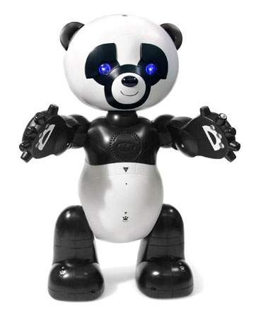

# Interfacing WowWee RoboPanda

  

## Introduction:

*From WowWee's website:*
    Robopanda™ is a playful and talkative interactive friend.  
    
    With his engaging personality and bright animated eyes, Robopanda™ loves to share stories and jokes, play games,
    sing songs and talk with children of all ages. He’s a fun-filled robotic bear who can even crawl on all fours
    and return to a sitting position.  
    
    Designed to work without a remote control, Robopanda™ is controlled directly by touch and sound.
    
    You'll experience hours of delight and entertainment playing with him and his interactive cartridge-based content.
    
    Training mode: Learn how to play with him while he guides you through his many features.
    
    Friend mode: Interact with his many conversations and enjoy his jokes.
    
    Menu mode: Robopanda™ will tell you stories, play games with you and even sing you a song or two!
    
    You can even teach him tricks that he will perform for you.
      - Realistic actions and interactive personality
      - Direct touch sensor and sound control
      - Interactive stories and games
      - Advanced artificial intelligence and awareness
      - Recognizes and talks to his own little toy panda (included)
      - Includes two Activity and Story cartridges
      - Equipped with safety sensors

## Purpose:

The WowWee Robopanda is a great "off the shelf" robot for building your own robot.

This repository contains my attempt to control/interface the RoboPanda using various widely available electronic components (Arduino, Raspberry Pi, etc...)

RoboPanda has battery compartments in the legs that hold 3 C batteries each (9v) and a good mix of input and output sensors.  There is also a battery compartment in the back that holds 4 AA batteries (6v).

| I/O | Type | Location |
|-------|-----------------------|-----------|
| Input | Accelerometer         | Left side |
| Input | Ball switch           | Back |
| Input | Capacitive touch      | Hands, Feet, Back, Chest, Back of head |
| Input | Microphone            | Chest |
| Input | RFID reader           | Chest |
| Input | Infra-red detector    | Left eye |
| Input | Potentiometer         | Hips, Shoulders, Upper arms, Head, Ears, Eye brows (Motor location encoders) |
| Input | Limit switches        | Eye brows and Ears |
| Output | LED                  | Hands, Eyes, Chest |
| Output | Speaker              | Chest |
| Output | DC Motor             | Hips, Shoulders, Upper arms, Head, Ears, Eye brows |
| Output | InfraRed emitter     | Nose |

# Main PCB  

References:
<ul>
  <li>
    <a href="http://arduino.cc">Arduino</a>
  </li>
  <li>
    <a href="http://python.org/">Python</a>
  </li>
  <li>
    <a href="http://www.raspberrypi.org/">Raspberry Pi</a>
  </li>
</ul>

## Raspberry Pi dependencies
`sudo apt-get install libatlas-base-dev python3-dev`

## Python dependencies
`python3 -m pip install -r requirements.txt`

## Arduino firmware
Upload the Standard Firmata example sketch to the Arduino Mega
